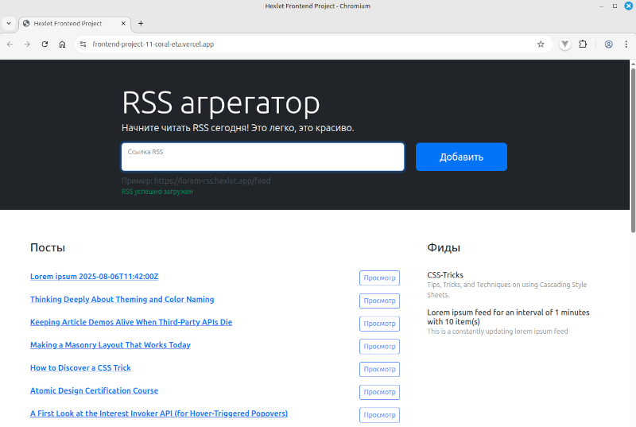

### Проект RSS агрегатор

Простой агрегатор новостных лент.

После подписания на канал, новости будут сразу же выведены на экран.

Проверка новостей происходит каждые 5 секунд.

Новые сообщения добавляются вверху списка новостей.

Можно подписаться сразу на несколько RSS каналов.

Подписка на каналы не сохраняется между перезагрузками страницы.

### Ссылка
https://frontend-project-11-git-main-chuvikovskys-projects.vercel.app/

### Используемые технологии и инструменты (без фреймворков):
- DOM API
- Bootstrap
- Axios
- yup (валидация)
- i18next (интернационализация)
- on-change (менеджер состояний)
- Webpack

### Локальная установка

Минимальные системные требования
- node - 20.15+
- npm - 10.8+

скопируйте репозиторий и перейдите в папку `frontend-project-11`
```
git clone https://github.com/Chuvikovsky/frontend-project-11.git
cd frontend-project-11
```

установите зависимости
```
make install
```

соберите проект
```
make build
```

